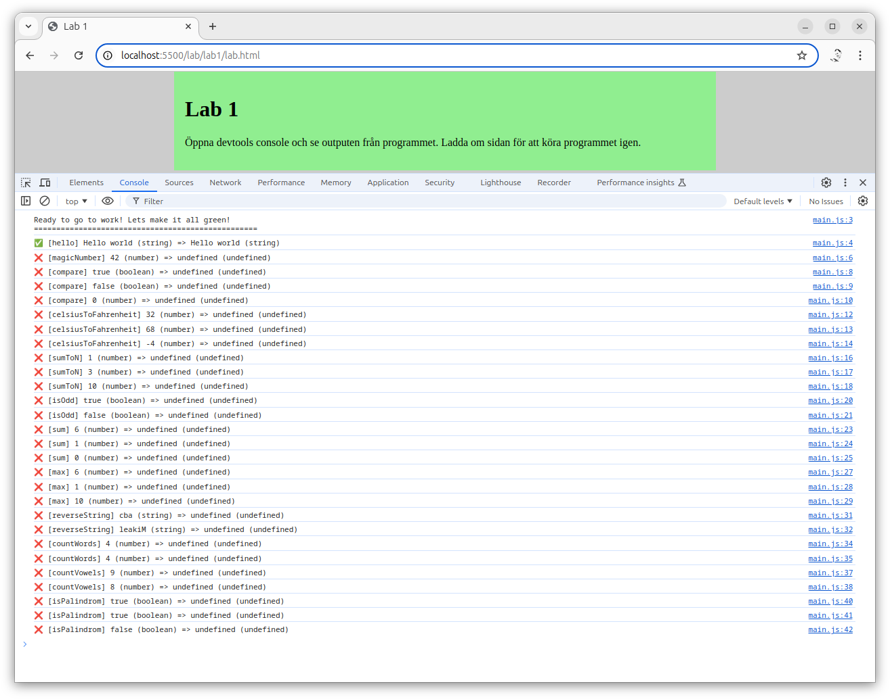
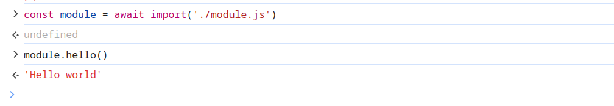

---
revision:
    "2024-10-03": "(B, mos) Removed css-file and dapted for bash."
    "2024-10-01": "(A, mos) First version."
---
Programmera grunderna i JavaScript
===========================

I denna övningen får du träna på att programmera med grunderna i programmeringsspråket JavaScript med siffor boolean, strängar och arrayer samt loopar och if-satser.

[[_TOC_]]

<!--
TODO

* rensa bort arrayer

* fixa så att if, if else , else täcks av uppgifterna

* fixa så att while och do-while täcks av uppgifterna

* string
    * replaceSpaces
    * capitalizeWords
    * countCharacter (vilket tecken förekommer mest)
    * säkerställ att string-övningarna underlättar att förbereda för hangman
-->


Förutsättning
---------------------------

Du kan grunderna i hur JavaScript samverkar med en webbsida och du kan grundkonstruktioner för villkor och iterationer i språket.

Du är medveten om hur du kan söka fram ny kunskap via manualen MDN.


Förberedelser
---------------------------

Förbered dig så här för övningen. Börja att öppna din terminal och gå till den katalog där du vill börja jobba.

Skapa nu en katalog för `lab1`.

```bash
mkdir lab1
cd lab1
```

Nu skall vi hämta tre filer från nätet som behövs för att komma igång med labben. Exekvera följande kommandon i terminalen.

```bash
curl --slient --output lab.html https://raw.githubusercontent.com/dbwebb-se/webtec2/refs/heads/main/lab/lab1/lab.html
curl --slient --output main.js https://raw.githubusercontent.com/dbwebb-se/webtec2/refs/heads/main/lab/lab1/main.js
curl --slient --output module.js https://raw.githubusercontent.com/dbwebb-se/webtec2/refs/heads/main/lab/lab1/module.js
curl --slient --output lab.js https://raw.githubusercontent.com/dbwebb-se/webtec2/refs/heads/main/lab/lab1/lab.js
```

När du är klar kan det se ut så här.

```bash
$ ls -l                                           
-rw-rw-r-- 1 mos mos  484 okt  3 16:01 lab.html   
-rw-rw-r-- 1 mos mos 3,9K okt  3 16:01 lab.js  
-rw-rw-r-- 1 mos mos 1,8K okt  3 16:01 main.js    
-rw-rw-r-- 1 mos mos 3,9K okt  3 16:01 module.js  
```

Nu kan du öppna din editor utifrån denna katalogen.

```
code .
```

Tittar runt i de filerna som finns i labben och försök förstå hur de hänger ihop.

Börja med att öppna webbsidan `lab.html` i din webbläsare via LiveServer.

Öppna din dev tools och fliken console. Här kan du exekvera hela labben och du får aktuell status utskriven.

Det kan se ut så här.



I filen `module.js` finns alla övningsuppgifter som du skall utföra i form av funktioner som skall implementeras. Varje gång du implementerar en funktion så kan du ladda om webbsidan för att se om det blir grönt eller rött.

Det som visas i devtools console är utskriften från `main.js` och det är tester som körs mot de funktioner som du skall implementera.

I filen `lab.js` finns de funktioner som utför testerna i labben och förbereder det som skrivs ut.


Första övningsuppgiften
---------------------------

I den första övningsuppgiften skall du implementera följande funktion.

```js
/**
 * Returns the string "Hello world".
 *
 * @returns {string} A welcome message "Hello world".
 */
export function hello () {
    // TODO: Write your code here.
}
```

När du är klar med din implementation så kan du ladda om din webbsida och se om det blev grönt.

Klicka på "Lösningsförslag" nedan för att se hur det kan se ut när du implementerat denna delen.

<details>
<summary>Lösningsförslag</summary>

```js
/**
 * Returns the string "Hello world".
 *
 * @returns {string} A welcome message "Hello world".
 */
export function hello () {
    // TODO: Write your code here.
    return "Hello world";
}
```

</details>


Provkör en funktion i devtools
---------------------------

Ibland vill man provköra sina egna funktioner i devtools. Du kan göra det på detta viset.

Importera modulen så den blir tillgänglig i devtools console.

```js
const module = await import('./module.js')
```

Nu har du den tillgänglig och kan anropa en metod som ligger i modulen.

```js
module.hello()
```

Det kan se ut så här när du gör det i devtools console.



Nu kan du implementera funktionerna, samtidigt som du kan testköra dem.


Lösning
---------------------------

Denna labben har en lösningsfil som du kan ladda ned och studera. Ibland finns flera olika lösningsförslat till en funktion.

Använd lösningen om du fastnar och inte lyckas ta dig vidare, eller som en studiehjälp för att jämföra dina egna lösningar med lösningar som någon annan har skrivit.

<details>
<summary>Hämta lösningsförslagen</summary>

```bash
# Stå i katalogen där du har labben
curl --silent --output solution.js https://raw.githubusercontent.com/dbwebb-se/webtec2/refs/heads/main/lab/lab1/solution.js
```

</details>
